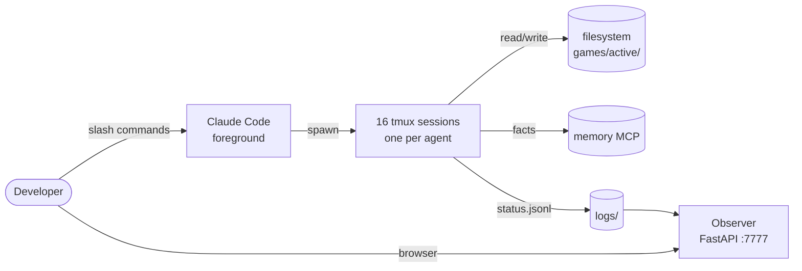

# Studio

> A multi-agent game-development framework for Claude Code.
> Built so one developer can ship a mobile game in eight weeks.


---

## Why Studio?

There are two common ways people use AI to make games today, and both are frustrating.

| Approach | Problem |
|---|---|
| **Manual chat** — ask ChatGPT/Claude piecewise and glue answers by hand | Slow, lossy, no shared memory between conversations |
| **Generic orchestrators** — CrewAI, AutoGen, AgentBuilder | Built for office workflows; no game-dev opinion, no game-engine opinion, no asset pipeline |

Studio sits in the middle: **an opinionated game-dev pipeline** with 16 specialist Claude Code agents that talk to each other through the filesystem, coordinated by a local FastAPI dashboard. The opinions are deliberate — Unity 6 LTS, GDD-first, CC0 assets only, mobile-first, single repo per studio with multiple games inside.

No paid third-party APIs. No cloud lock-in. `git init` and go.

## What it looks like

```
studio/
├── core/               ← framework: agents, scripts, observer, templates
├── games/              ← products: one folder per game
│   └── brave-bunny/    ← first game (action roguelite)
└── shared/             ← cross-game assets, UI kits, shaders
```

Spin up a new game with one command:

```bash
./core/scripts/new-game.sh my-second-game --template puzzle
```

Then watch 16 agents fan out and start writing your design doc, art bible, tech spec, and engine code.

## Engine pivot — May 2026

Studio originally used Unity 6 LTS. In May 2026 we pivoted to **Three.js + React Three Fiber + Capacitor 7** for the iOS-first product (Brave Bunny). Rationale: Unity Editor's GUI-dependency made parallel-agent authoring brittle. The web-tech stack keeps 100% of authoring in plain text files, ships to iOS through the existing fastlane pipeline via Capacitor, and unlocks parallel-agent dispatch end-to-end.

Details: [`docs/superpowers/specs/2026-05-16-engine-pivot-design.md`](docs/superpowers/specs/2026-05-16-engine-pivot-design.md)

## Quick start

```bash
git clone https://github.com/OmerYasirOnal/studio
cd studio

# Bootstrap the observer dashboard
./core/scripts/observer-start.sh         # http://localhost:7777

# Run the active game in dev
cd games/$(cat .active-game)/app
npm ci
npm run dev                              # http://localhost:5173
```

iOS build:

```bash
cd games/$(cat .active-game)/app
npm run build
npx cap sync ios
cd ../tools/ci
fastlane beta                            # → TestFlight
```

## Architecture



Every agent runs in its own clean Claude Code conversation. They never read each other's chat history — only the files they produce. That keeps token cost flat as the team scales.

## The agent roster

| # | Agent | Owns |
|---|---|---|
| 1 | orchestrator | Phase gates, spawning, blocker resolution |
| 2 | researcher | Market analysis, competitor deconstructions |
| 3 | game-designer | GDD, core loop, meta loop |
| 4 | narrative-designer | Lore, character voice |
| 5 | ux-designer | User stories, flows, wireframes |
| 6 | tech-architect | Engine choice, data model, save system |
| 7 | art-director | Art bible, asset budget, audio direction |
| 8 | asset-curator | CC0 fetching (Quaternius, Kenney, Freesound) |
| 9 | blender-tech | Blender Python recolor / retex / props |
| 10 | level-designer | Biomes, wave patterns, boss arenas |
| 11 | balance-engineer | Damage formulas, XP curves, drop tables |
| 12 | gameplay-engineer | Unity C# combat + core loop |
| 13 | systems-engineer | Save/load, progression, persistence |
| 14 | ui-engineer | HUD, menus, UI Toolkit |
| 15 | qa-engineer | Test plans, EditMode + PlayMode tests |
| 16 | build-engineer | Fastlane, iOS build, TestFlight |

## Games built with Studio

| Game | Genre | Status | Folder |
|---|---|---|---|
| **Brave Bunny** | Action roguelite (Survivor.io-like) | Phase 3 complete (Tech Architecture) — Phase 5 (Prototype) gated on tmux + Unity install | [`games/brave-bunny/`](games/brave-bunny/) |

## Roadmap

- **v0.1** — Brave Bunny ships to TestFlight (this repo state)
- **v0.2** — Second game in a different genre; framework hardened from Brave Bunny's pain points
- **v0.3** — Godot 4 support alongside Unity 6
- **v0.4** — Steam desktop build template

## License

MIT — see [LICENSE](LICENSE).

All bundled assets in `core/templates/_common/` and `shared/` are CC0 or SIL OFL. See `core/docs/asset-policy.md` for the source list. Per-game asset licenses are tracked in `games/<name>/assets-raw/LICENSES.md`.

## Contributing

See [CONTRIBUTING.md](CONTRIBUTING.md). The four hard rules are: zero paid APIs, CC0 assets, framework/game separation, conventional commits.

---

Built by [Yasir Önal](https://github.com/omeryasironal) with Claude Code Opus.
