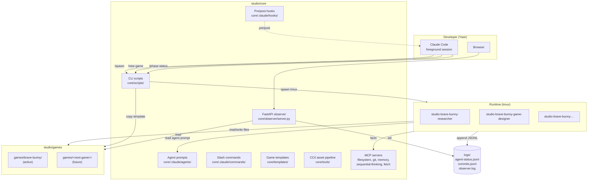

# Architecture



## Repo layout

```
studio/
├── README.md            ← public-facing entry point
├── LICENSE              ← MIT
├── CLAUDE.md            ← framework-level rules for Claude Code
├── CHANGELOG.md         ← only tracks core/
├── CONTRIBUTING.md
├── .active-game         ← single-line: name of the active game folder
├── .github/             ← Issue templates + Actions workflows
├── core/                ← THE FRAMEWORK
│   ├── VERSION
│   ├── .claude/         ← agents, commands, hooks, mcp.json
│   ├── scripts/         ← new-game, spawn-agent, observer-start, ralph, status
│   ├── observer/        ← FastAPI + static HTML dashboard
│   ├── templates/       ← game scaffolds (action-roguelite, endless-runner, puzzle)
│   ├── tools/           ← asset-pipeline, balance-tools, blender-pipeline
│   └── docs/            ← this directory
├── games/               ← THE PRODUCTS
│   └── brave-bunny/     ← first game; one folder per game
├── shared/              ← cross-game shared assets (ui-kit, audio-library, shaders)
└── logs/                ← framework-wide JSONL logs
```

## Cardinal rules

1. **`core/` is game-agnostic.** Never reference a specific game by name in `core/`. Use `<active>` placeholders, read `.active-game`, parametrize on slug.

2. **Agents are stateless across sessions.** Their only state is the filesystem and `memory` MCP. Spawn-agent.sh always opens a clean Claude Code conversation.

3. **The orchestrator is idle between phases.** It does not poll. It does not babysit. Specialists work independently in their own tmux sessions.

4. **No paid APIs.** Anywhere. Ever. The framework guarantees a fresh clone can ship a game with zero account creation beyond Apple Developer / Google Play Console (only at publish time).

## Data flow at runtime

1. User types `/spawn researcher "deconstruct survivor.io"` in foreground Claude Code
2. `spawn-agent.sh` reads `.active-game`, looks up the researcher prompt, opens `studio-brave-bunny-researcher` tmux session
3. Researcher reads `games/brave-bunny/GAME.md`, fetches competitor pages via `fetch` MCP, writes `games/brave-bunny/docs/01-research/02-competitors/01-survivor-io.md`
4. Researcher appends `status: working` events to `logs/agent-status.jsonl`
5. Observer at `localhost:7777` shows the file landing in the recent-handoffs panel
6. Researcher writes `games/brave-bunny/docs/handoffs/researcher-<ts>.md` at end of session
7. Next agent (game-designer) is spawned by orchestrator and reads only the hand-off + GDD section it needs

## Why this design

- **Token cost is flat** as the team grows because each tmux session has its own minimal context
- **Failures isolate**: a crashed agent doesn't take down the orchestrator
- **Resumability**: any agent can be re-spawned from a known checkpoint (its hand-off note)
- **Composability**: a new game = a new folder; framework code unchanged
