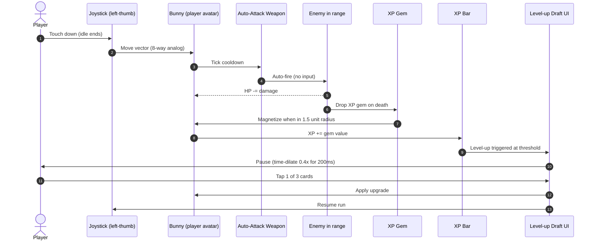
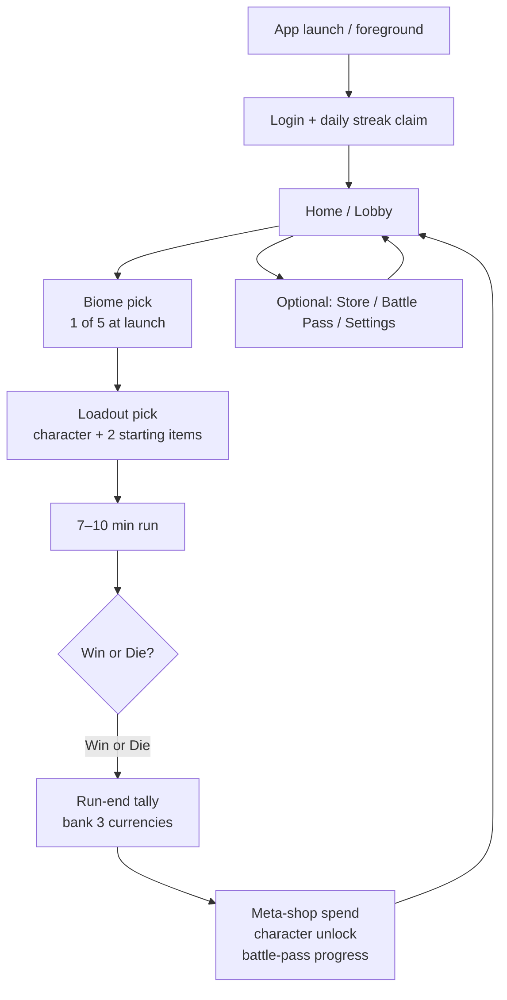

# GDD 01 — Core Loop

> The minute-to-minute and session-to-session loops of Brave Bunny, plus the failure (death) loop, the auto-attack contract, pickup behaviors, and the level-up draft. Sister docs: `00-overview.md` (pillars + scope), `11-feel-pillars.md` (game-feel specs).

## Minute-to-minute loop (in-run)

The smallest playable unit is **idle → move → kill → pick up → level-up → draft → resume**. This cycle repeats 15–25 times per run (the draft-cadence anchor from `docs/01-research/03-positioning.md`).

### Loop properties

- **Hands-off vs hands-on** — combat is auto. The player's only inputs are: (a) left-thumb joystick to move, (b) right-thumb tap on draft cards, (c) right-thumb tap on rewarded-ad / revive prompts. No fire button.
- **Cycle length** — first level-up at ~25 s; later level-ups every 20–40 s depending on density. Total cycles per run: 15–25.
- **No dead air** — even between draft events, gold + heart pickups + miniboss telegraphs maintain attention. The 11-feel-pillars doc enforces "every kill must shake the room" so the loop never goes silent.

## Session-to-session loop (out-of-run)

The session loop wraps the run loop with daily-streak claim, biome + loadout selection, and the end-of-run currency-bank screen that feeds three meta systems.

### Step contracts

- **Login + streak** — opens a 0-input modal; tap any-where to claim. Day-7 of the streak grants a cosmetic shard. Missing a day resets to day-1 but does **not** lock content.
- **Biome pick** — five tiles, one row, horizontal scroll. Locked biomes show a single requirement ("Reach Bunny Lv 5"), never a paywall.
- **Loadout pick** — 1 character slot + 2 starting-item slots. Slots 1 and 2 are unlocked by default; cosmetic slot 3 is post-launch.
- **Run** — opaque to the meta. Once started, the run is sandboxed; meta state cannot change mid-run.
- **Run-end tally** — three currencies bank in series with a 250 ms slam-per-line animation: **Gold**, **Soul-shards**, **Pass-XP**. The tally screen is *non-skippable for the first 0.8 s* (so the dopamine lands) and then a single-tap dismisses.
- **Meta-shop / unlock / pass** — three buttons under the tally. None of them gate "Play Again": the loop always returns to Home in ≤ 2 taps.

## Failure loop (death)

Death is a celebration of the run, not a punishment. The "every run pays" dignity loop is cribbed from Vampire Survivors and is non-negotiable per `00-overview.md` pillar 3.

### What's preserved on death

- **100% of gold** earned in the run (banks to Home wallet).
- **100% of soul-shards** earned (banks to Meta currency).
- **100% of pass-XP** earned (banks to active Battle Pass).
- **Character-level XP** earned (banks to the played hero).
- **Run statistics** (best DPS, longest streak, etc. — for leaderboards / daily missions).

### What's lost on death

- **The build** — the in-run weapon stack, levels, and evolutions all reset. The next run starts from level 1.
- **Run-only consumables** — temporary buffs picked up mid-run (e.g. 60 s damage potions) expire.
- **Active wave timer** — the wave schedule resets to wave 1 on the next run.

### Revive offer (rewarded ad)

- Triggered at HP = 0 **once per run**.
- Shows: "Watch ad to revive at 50% HP" + 5 s countdown.
- Accepting plays the rewarded ad → respawn at death position with `currentHP = 0.5 * maxHP` and 1.5 s of i-frames.
- Declining advances directly to the run-end tally.
- The decline button is the **larger** of the two (rewarded-ad-positive but not rewarded-ad-coercive).

## Auto-attack details

Auto-attack is the entire combat input model. Every weapon obeys this contract; per-weapon tuning lives in `data/balance/weapons.json` once balance-engineer authors it.

- **Range** — per weapon. Baselines:
  - Melee (Carrot Spear): 1.5 units front-arc.
  - Projectile (Pebble Sling): 6.0 units, auto-target nearest visible.
  - Aura (Honey Aura): 2.5 unit radial, self-centered.
- **Fire rate** — per weapon, expressed as cooldown in ms:
  - Melee baseline: 600 ms.
  - Projectile baseline: 800 ms.
  - Aura baseline: ticks every 400 ms.
- **Target priority** —
  1. Nearest enemy in range with HP > 0.
  2. Tie-break: enemy whose nearest-point is most aligned with the player's facing vector (within ±60° front arc preferred).
  3. Tie-break: enemy with lowest current HP (cleanup bias, prevents "wasted" overkill on tanks).
- **Recharge / interruption** — cooldown ticks continuously, including while moving. No "wind-up" stagger. Damage-taken does **not** interrupt cooldown. The only thing that pauses cooldown is the level-up time-dilate (see below).
- **Crit** — global crit chance default 0; crits ride on draft upgrades only. Crit multiplier baseline 2.0x.

## Pickup behaviors

Pickups are the proprioception of the loop — they are how the player *feels* progress. The feel-pillar doc enforces the visual + audio side; this section is the behavior contract.

- **XP gem** — drops from every non-trash enemy. Three tiers (small / medium / large) keyed to enemy XP value. Magnetizes when player enters a **1.5 unit radius**. On pickup: scale-pulse 1.0 → 1.4 → 1.0 over 120 ms, soft chime at −3 dB. Pickup adds to the run-XP bar.
- **Gold coin** — drops from ~20% of enemies and 100% of elites. **Auto-magnetizes** from anywhere on screen on enemy death (no walk-required). On pickup: gold-burst sparkle + coin-clink at −6 dB. Banks at run-end.
- **Heart** — rare drop (~3% of enemies, 100% of bosses). Heals **20% of max HP** on pickup, capped at max. Magnetize radius **2.5 units**. On pickup: red pulse VFX on hero, "thump" at −3 dB.
- **Magnet pickup** — uncommon (~1% of enemies). On pickup, pulls **all on-screen XP gems** to the player over 300 ms with a sweep-arc animation and a layered chime.
- **Chest** — guaranteed drop from elites and the mid-run miniboss. On pickup, opens a free 3-of-N draft (no level-up required).

## Level-up draft details

The draft is the core decision moment. Cadence target: **15–25 events per run**, per the positioning brief.

- **Trigger** — player XP bar fills to threshold. XP-to-next-level follows a published curve (owner: balance-engineer; placeholder in `data/balance/xp-curve.json`).
- **Pause behavior** — game time-dilates to **0.4x for 200 ms** (the "celebration" pillar), then fully pauses. UI cards slam in with an overshoot bezier (see feel-pillars).
- **Always 3 options** — even if the player has banished options or if a roll fails, the system retries until 3 distinct cards are present. Never less, never more.
- **1 banish per run** — a "🚫" button on each card removes it from the run's future draft pool. The first banish is free; the second costs a rewarded ad. Hard cap of **2 banishes per run total**.
- **1 re-roll per run** — same UX as banish, single "🎲" button at the bottom. First re-roll free; second is rewarded-ad. Hard cap of **2 re-rolls per run**.
- **Locked rares unlock by character level** — rare-tier upgrades show as a greyed silhouette until the character's meta-level meets the unlock threshold (Bunny Lv 3 unlocks Carrot Bomb, Lv 5 unlocks Bouncing Cob, etc. — full table in `10-balance/upgrade-pool.md`).
- **Card layout** — 3 cards stacked vertically on portrait, sized to be tappable on iPhone SE 3 (≥ 88 pt tap target, the iOS HIG minimum), each card shows: icon, name, 1-line description, current → next stat delta.
- **No "smart" recommendations at launch** — the player picks. Post-launch we may add a "suggested for your build" tag, but never auto-pick.

## Anchors carried forward

| Anchor | Value | Source |
|---|---|---|
| Run length | 7–10 min | `positioning.md` |
| Draft cadence | 15–25 events / run | `positioning.md` |
| Roster at launch | 8 characters | `GAME.md` thesis |
| Roster in vertical slice | 1 character (Bunny) | This doc, scope section |
| D1 retention target | ≥ 40% | `positioning.md` north-star |
