# UX Flow 01 — Cold Start

> The full path from app-icon tap (cold process) to the player feeling competent — defined as "first kill landed with confidence." Owner: ux-designer. Consumers: ui-engineer, gameplay-engineer, systems-engineer. Source user stories: US-01..12, US-31, US-37. Tone bible: friendly-older-sibling, all visible strings keyed `{KEY}`. Positioning: no login wall, FTUE ≤ 60 s, cold-start → first kill ≤ 30 s p95.

## KPI guardrails

- **`ftue_first_kill_seconds` p95 ≤ 30 s** (US-04) — single most-tracked onboarding telemetry event.
- **`cold_start_to_home_seconds` ≤ 8 s** on iPhone SE 3 (US-01).
- **Returning-user cold start → Home ≤ 6 s** (US-02).
- **Total FTUE elapsed ≤ 60 s median** from icon tap to first kill (US-01).

## Screens referenced

| Screen key | Wireframe target | First appearance |
|---|---|---|
| `screen=splash` | `05-wireframes/00-splash.html` | both paths |
| `screen=language_confirm` | `05-wireframes/10-language-confirm.html` | first-time only |
| `screen=ftue_coachmark_move` | `05-wireframes/05-coachmark-joystick.html` | first-time only |
| `screen=run_hud` | `05-wireframes/13-hud-joystick.html` + `21-hud-safe-area.html` | both paths |
| `screen=home` | `05-wireframes/36-home-play-cta.html` + `31-home-next-thing.html` | both paths |
| `screen=daily_streak_modal` | `05-wireframes/37-daily-streak.html` | returning users (1×/day) |
| `screen=home_tour` | `05-wireframes/09-home-tour.html` | post first run-end only |

## Flow

```mermaid
flowchart TD
    A[App icon tap<br/>screen=splash<br/>budget: 2.0 s<br/>US-04] --> B[Bootstrap services<br/>load local profile<br/>read NSLocale<br/>budget: ≤ 1.5 s<br/>US-08]
    B --> C{playerProfile<br/>firstRunCompleted?<br/>US-02}

    %% ===== FIRST-TIME PATH =====
    C -->|no — first time| D[Language confirm modal<br/>screen=language_confirm<br/>copy: TR + EN both shown<br/>budget: ≤ 4 s player time<br/>US-10]
    D --> E[Auto-spawn Meadow run<br/>no menu interstitial<br/>budget: ≤ 1.0 s load<br/>US-04]
    E --> F[FTUE run begins<br/>screen=run_hud<br/>8 enemies pre-placed in 4-unit radius<br/>US-04]
    F --> G[Pulsing ring + ghost-thumb<br/>coach mark over joystick zone<br/>screen=ftue_coachmark_move<br/>spawns within 1.0 s of run start<br/>copy: FTUE_MOVE<br/>US-05]
    G --> H{Player input<br/>down event?}
    H -->|yes — first frame| I[Coach mark dismisses<br/>≤ 16.6 ms response<br/>Pillar 5<br/>US-05]
    H -->|no input for 8 s| J[Coach mark re-pulses<br/>at 2x amplitude<br/>no re-explain<br/>US-05]
    J --> H
    I --> K[Auto-attack engages<br/>nearest of 8 spawned rascals<br/>weapon: Carrot Spear default<br/>US-19]
    K --> L[First kill<br/>screenshake 2 px<br/>kill-stinger SFX -9 dB<br/>no FTUE text overlay<br/>Pillar 1<br/>US-04]
    L --> M[Telemetry fire<br/>ftue_first_kill_seconds<br/>guardrail: ≤ 30 s p95<br/>US-04]
    M --> N[XP gem drops within 1.5 unit<br/>magnetize + chime<br/>no text overlay<br/>screen=run_hud<br/>US-07]
    N --> O[Player kills 4-6 more rascals<br/>XP bar fills<br/>budget: ~25 s to first level-up<br/>US-07]
    O --> P[First level-up<br/>0.4x dilate 200 ms then pause<br/>Pillar 2<br/>US-06]
    P --> Q[Draft coach mark<br/>copy: FTUE_DRAFT<br/>3 pre-filtered easy cards<br/>no rare silhouettes<br/>US-06]
    Q --> R{Player taps card?}
    R -->|tap| S[Coach mark fades 120 ms<br/>upgrade applied<br/>run resumes<br/>US-06]
    R -->|no tap for 8 s| T[Card pulses<br/>no new copy<br/>US-06]
    T --> R
    S --> U[FTUE run continues<br/>HP floor = 1<br/>cannot die<br/>3-min hard timer<br/>US-12]
    U --> V[FTUE run-end<br/>copy: FTUE_END<br/>Whew. Worth a carrot.<br/>~50 gold banked<br/>0 soul-shards<br/>screen=runend_ftue<br/>US-12]
    V --> W[Run-end tally banks<br/>800 ms non-skippable<br/>US-18]
    W --> X[Mark<br/>firstRunCompleted=true<br/>US-02]
    X --> Y[Home screen first entry<br/>screen=home<br/>US-09]
    Y --> Z[Home tour begins<br/>screen=home_tour<br/>3 steps: biome / loadout / Play<br/>auto-advance 4 s or tap<br/>Skip top-right<br/>copy: TOUR_SKIP<br/>US-09]
    Z --> AA[Home idle<br/>Play pre-focused<br/>strap: NEXT_NUDGE_PLAY<br/>US-31, US-36]

    %% ===== RETURNING PATH =====
    C -->|yes — returning| BB[Skip language confirm<br/>skip FTUE entirely<br/>budget saved: ~50 s<br/>US-02]
    BB --> CC{First session<br/>today?<br/>US-37}
    CC -->|yes — daily eligible| DD[Home loads<br/>screen=home<br/>budget: ≤ 6 s total cold start<br/>US-02]
    DD --> EE[Daily streak modal overlays<br/>screen=daily_streak_modal<br/>0-input tap-anywhere<br/>copy: DAILY_STREAK_HOOK<br/>US-37]
    EE --> FF{Player taps<br/>anywhere?}
    FF -->|tap| GG[Reward claimed<br/>animation 1.2 s if day-7<br/>modal dismisses<br/>US-37]
    FF -->|wait| FF
    GG --> AA
    CC -->|no — already claimed| HH[Home loads directly<br/>screen=home<br/>strap reflects next pending item<br/>US-31]
    HH --> AA

    %% ===== HOME IDLE OUTCOMES =====
    AA --> II[End of cold-start flow<br/>handoff → 02-run-loop<br/>or → 03-meta]

    %% ===== ANTI-PATTERNS =====
    A -. forbidden .-> XX[NO interstitial ad<br/>NO ATT prompt<br/>NO notification prompt<br/>NO account-create wall<br/>US-03, US-08, US-46]
```

## Permission deferral rules (US-03)

- iOS ATT prompt: earliest after **2nd** run-end tally, with preamble copy `{ATT_PREAMBLE}`. Not in this flow.
- Notification permission: only after user opts in to daily-streak reminder toggle on Home (out-of-flow).
- Account-link offer: Settings only, no nag modal on Home (US-08).

## First-time micro-budget breakdown (target totals)

| Stage | Budget | Cumulative |
|---|---|---|
| Splash + bootstrap | 2.0 s + 1.5 s | 3.5 s |
| Language confirm tap | 3.0 s player time | 6.5 s |
| Auto-spawn run load | 1.0 s | 7.5 s |
| Joystick coach-mark dismiss | 2.0 s | 9.5 s |
| Move-and-engage first enemy | 4.0 s | 13.5 s |
| First-kill landed | 4.0 s | **17.5 s** (p50) |
| First kill p95 guardrail | — | **≤ 30 s** (US-04) |

## Returning-user micro-budget

| Stage | Budget | Cumulative |
|---|---|---|
| Splash + bootstrap | 2.0 s + 1.5 s | 3.5 s |
| Skip FTUE branch | 0 s | 3.5 s |
| Home render + streak modal overlay | 2.0 s | **5.5 s** (≤ 6 s guardrail, US-02) |

## Tone-bible-validated copy in this flow

- `{FTUE_MOVE}: "Drag your thumb. Bunny will follow."` (US-05)
- `{FTUE_DRAFT}: "Pick a gift. You can only take one."` (US-06)
- `{FTUE_END}: "Nice work. Off home for some carrots."` (US-12)
- `{DAILY_STREAK_HOOK}: "Three days running. Sturdy little adventurer."` (US-37)
- `{NEXT_NUDGE_PLAY}: "Off we go. Carrots await."` (US-31)
- `{TOUR_SKIP}: "Skip the tour."` (US-09)

## Anti-pattern enforcement

- No "Game Over", "Press Start", "Tap to Continue" English-only strings. All strings keyed.
- No splash-screen ad slot (zero ads in cold-start).
- No login wall (US-08) — local-anonymous profile only.
- No FTUE step that requires reading more than 1 line of text (US-01).
- FTUE narrative cutscene is **deferred** to between-run mailbox per US-01 acceptance row 4.
