# UX Flow 02 — Run Loop

> The in-run flow from "biome selected" on Home through "run-end tally finished banking." This is where retention is won or lost — see US-02 (run user-stories) and `02-gdd/01-core-loop.md`. Owner: ux-designer. Consumers: gameplay-engineer, ui-engineer, systems-engineer. Sources: US-13..30, US-27 chest-draft, Feel Pillars 1–8, tone bible.

## KPI guardrails

- **`pointer_to_velocity_ms` ≤ 16.6 ms p99** (US-13) — 1-frame joystick response.
- **`draft_pick_seconds` median ≤ 2.0 s** (US-14) — read all 3 cards and tap.
- **Run length 7–10 min** target (positioning anchor; `01-core-loop.md`).
- **Draft cadence 15–25 events per run** (`01-core-loop.md`).
- **Run-end tally 800 ms non-skippable** before any IAP/ad surface (US-18, Pillar 6).
- **"Play Again" path ≤ 2 taps** from run-end (US-30).

## Screens referenced

| Screen key | Wireframe target | Fires when |
|---|---|---|
| `screen=loadout_pick` | `05-wireframes/41-loadout-cosmetic.html` | Home → Play |
| `screen=biome_selector` | `05-wireframes/39-biome-selector.html` | Home → biome row tap |
| `screen=countdown` | wireframe placeholder | Pre-run 3-2-1 |
| `screen=run_hud` | `05-wireframes/13-hud-joystick.html` + `21-hud-safe-area.html` | Every run frame |
| `screen=wave_strap` | `05-wireframes/28-wave-strap.html` | Every wave change |
| `screen=draft_levelup` | `05-wireframes/14-levelup-draft.html` + `23-draft-tooltip.html` | Each level-up |
| `screen=draft_chest` | `05-wireframes/27-chest-draft.html` | Elite / miniboss chest |
| `screen=draft_evolution` | `05-wireframes/25-evolution-card.html` | Prereqs met |
| `screen=boss_intro` | `05-wireframes/17-boss-intro.html` | Boss spawn |
| `screen=pause_modal` | `05-wireframes/16-pause-modal.html` | Pause button tap |
| `screen=revive_offer` | `05-wireframes/22-revive-offer.html` | HP=0 first time per run |
| `screen=death_celebration` | `05-wireframes/26-death-celebration.html` | Decline revive or 2nd death |
| `screen=runend_tally` | `05-wireframes/18-runend-tally.html` + `30-runend-buttons.html` | After death/win |
| `screen=2x_gold_offer` | `05-wireframes/47-2x-gold-offer.html` | After tally banks |
| `screen=bp_progress_strip` | `05-wireframes/35-bp-progress-strip.html` | After 2x-gold flow |

## Flow

```mermaid
flowchart TD
    %% ===== PRE-RUN =====
    A[Home<br/>Play CTA pre-focused<br/>screen=home<br/>US-36] --> B{Loadout already set?}
    B -->|yes — defaults exist| C[Loadout auto-applied<br/>character=Bunny<br/>weapon=Carrot Spear<br/>budget: 0 s<br/>US-01 vertical slice]
    B -->|no — first time| D[Loadout pick<br/>screen=loadout_pick<br/>character carousel<br/>2 starter slots<br/>budget: ≤ 5 s player time]
    D --> C
    C --> E{Biome already chosen?}
    E -->|yes / vertical slice| F[Auto-Meadow<br/>budget: 0 s<br/>US-04 FTUE compatible]
    E -->|no — player taps biome| G[Biome selector<br/>screen=biome_selector<br/>5 tiles horizontal row<br/>locked tiles show requirement string<br/>no paywall modal<br/>US-39]
    G --> H{Biome locked?}
    H -->|locked| I[Non-blocking tooltip<br/>requirement copy<br/>US-39]
    I --> G
    H -->|unlocked tap| F
    F --> J[Countdown 3-2-1<br/>screen=countdown<br/>budget: 1.5 s<br/>BGM swells]
    J --> K[Run begins<br/>screen=run_hud<br/>BGM in-run track<br/>wave 1 spawns 8 enemies]

    %% ===== PER-WAVE INNER LOOP =====
    K --> L[Wave strap<br/>screen=wave_strap<br/>wave X label<br/>600 ms rumble -9 dB<br/>auto-fade 800 ms<br/>US-28]
    L --> M[Player moves<br/>joystick floating bottom-left<br/>≤ 1-frame response<br/>Pillar 5<br/>US-13]
    M --> N[Auto-attack fires<br/>weapon icons pulse<br/>target outline 1 frame -30% lum<br/>Pillar 4<br/>US-19]
    N --> O[Enemy hit<br/>hit-flash 50 ms<br/>knockback 3 px<br/>Pillar 4<br/>US-19]
    O --> P{Enemy HP ≤ 0?}
    P -->|no| M
    P -->|yes| Q[Kill response<br/>2 px shake trash / 4 px elite / 8 px boss<br/>kill-stinger -9 to -3 dB<br/>corpse-puff 8-12 particles<br/>Pillar 1]
    Q --> R{Drops?}
    R -->|XP gem 100%| S[Gem on ground<br/>magnetize at 1.5 unit<br/>Pillar 3<br/>US-07]
    R -->|gold 20% trash / 100% elite| T[Gold sweep arc<br/>auto-magnet full screen<br/>300 ms<br/>US-24]
    R -->|heart 3% / boss 100%| U[Heart bobs<br/>magnet at 2.5 unit<br/>walk-required<br/>US-24]
    R -->|magnet 1%| V[Pulls all gems<br/>sweep 300 ms<br/>layered chime]
    R -->|chest elite/miniboss| W[Chest pickup<br/>opens free draft<br/>screen=draft_chest<br/>US-27]
    S --> X[XP bar fills 80 ms lerp<br/>Pillar 3]
    T --> Y[Gold counter ticks]
    U --> Z[HP +20% capped]
    V --> X
    X --> AA{XP bar full?}
    AA -->|no| M
    AA -->|yes| AB[Level-up trigger<br/>0.4x dilate 200 ms<br/>then full pause<br/>Pillar 2]

    %% ===== DRAFT MODAL =====
    AB --> AC[Draft modal slams in<br/>screen=draft_levelup<br/>3 cards vertical stack<br/>overshoot bezier 280 ms<br/>40 ms stagger<br/>US-14]
    AC --> AD{Evolution<br/>prereqs met?<br/>US-25}
    AD -->|yes| AE[Evolution card surfaces<br/>glowing border<br/>copy: LEVEL_UP_EVOLVE<br/>screen=draft_evolution<br/>US-25]
    AD -->|no| AF[Standard 3-of-N pool<br/>locked rares show silhouette<br/>per character meta-level]
    AE --> AG
    AF --> AG[Card affordances visible<br/>banish glyph top-right<br/>re-roll bottom<br/>tooltip on long-press<br/>US-15, US-23, US-29]
    AG --> AH{Player action}
    AH -->|tap card| AI[Card-pick anim 280 ms<br/>upgrade applied<br/>celebration 1.2 s if evolution<br/>US-14, US-25]
    AH -->|tap banish glyph| AJ{Banish quota<br/>used this run?}
    AJ -->|0 used — free| AK[Card removed from pool<br/>logged for run-end<br/>US-15]
    AJ -->|1 used| AL[Rewarded-ad opt-in modal<br/>decline larger pre-focused<br/>US-15, US-22 pattern]
    AJ -->|2 used cap| AM[Affordance hidden<br/>US-15]
    AK --> AC
    AL --> AC
    AH -->|tap re-roll| AN{Re-roll quota?}
    AN -->|0 — free| AO[Cards animate out top / in bottom<br/>280 ms overshoot<br/>no duplicate 3-set<br/>US-29]
    AN -->|1 used| AP[Rewarded-ad opt-in<br/>decline larger pre-focused<br/>US-29]
    AN -->|2 cap| AQ[Affordance hidden]
    AO --> AC
    AP --> AC
    AH -->|long-press card| AR[Stat tooltip<br/>1-line description<br/>auto-dismiss on release<br/>US-23]
    AR --> AC
    AI --> AS[Resume run<br/>time back to 1.0x<br/>BGM unducks]
    AS --> M

    %% ===== CHEST DRAFT (alt entry) =====
    W --> AT[Chest draft modal<br/>chest-icon strap<br/>screen=draft_chest<br/>banish/re-roll quotas NOT consumed<br/>US-27]
    AT --> AC

    %% ===== BOSS ENCOUNTER =====
    L -. scheduled at wave X .-> AU[Boss spawn signal<br/>BGM transition]
    AU --> AV[Boss intro card<br/>screen=boss_intro<br/>0.4x dilate 600 ms<br/>portrait + name slides from bottom<br/>copy: BOSS_INTRO_X<br/>US-17]
    AV --> AW{First encounter<br/>this profile?}
    AW -->|yes — full dwell| AX[Auto-dismiss 1.8 s<br/>tap-skip after first 600 ms<br/>US-17]
    AW -->|repeat| AY[Dwell 200 ms<br/>auto-dismiss 800 ms<br/>US-17]
    AX --> AZ[Boss fight begins<br/>screen=run_hud<br/>BGM boss layer]
    AY --> AZ
    AZ --> BA[Boss attack telegraph<br/>≥ 600 ms wind-up<br/>yellow AoE → red flash final 200 ms<br/>US-20]
    BA --> M

    %% ===== PAUSE INTERRUPT =====
    M -. pause button tap .-> BB[Pause modal<br/>screen=pause_modal<br/>time halt<br/>audio fade -12 dB 200 ms<br/>3 options<br/>US-16]
    BB --> BC{Choice}
    BC -->|Resume| BD[Audio + speed restore 200 ms ease-out]
    BD --> M
    BC -->|Settings| BE[→ flow 05-settings]
    BC -->|Head home for now| BF[Confirm tap<br/>copy: BTN_CONFIRM_QUIT_RUN<br/>treat as death for banking<br/>US-16]
    BF --> BL

    %% ===== DEATH / WIN =====
    M -. HP = 0 .-> BG{Revive already<br/>used this run?<br/>US-22}
    BG -->|no| BH[Revive modal<br/>screen=revive_offer<br/>Watch ad smaller<br/>Head home larger pre-focused<br/>5 s auto-decline countdown<br/>copy: HERO_REVIVE<br/>US-22]
    BH --> BI{Choice}
    BI -->|Watch ad| BJ[Rewarded-ad SDK<br/>respawn 50% HP<br/>1.5 s i-frames<br/>back to run]
    BI -->|Head home / timeout| BL
    BJ --> M
    BG -->|already used| BK[Death celebration<br/>screen=death_celebration<br/>0.3x dilate 300 ms<br/>60-particle gold burst<br/>camera dolly 5%<br/>no Game Over string<br/>US-26]
    BK --> BL
    M -. timer ends WIN .-> BL[Run-end tally begins]

    %% ===== RUN-END TALLY =====
    BL --> BM[Tally slides up 400 ms<br/>screen=runend_tally<br/>Pillar 6<br/>US-18]
    BM --> BN[Gold line slams 250 ms count + tick<br/>at -9 dB]
    BN --> BO[Soul-shards line slams 250 ms]
    BO --> BP[Pass-XP line slams 250 ms]
    BP --> BQ[First 800 ms<br/>NON-SKIPPABLE<br/>NO IAP NO ad NO nag<br/>US-18, US-46]
    BQ --> BR[Tally interactive<br/>3 buttons: Head home / Play again / Share run<br/>Head home pre-focused<br/>US-30]
    BR --> BS{Tier crossed<br/>during run?<br/>US-35}
    BS -->|yes| BT[BP progress strip slides<br/>screen=bp_progress_strip<br/>claim-ready pulse<br/>auto-advance 4 s<br/>US-35]
    BS -->|no| BU
    BT --> BU{2x-gold offer<br/>not yet shown this run?<br/>US-47}
    BU -->|show once| BV[2x-gold modal<br/>screen=2x_gold_offer<br/>Watch ad smaller<br/>Take what I earned larger pre-focused<br/>8 s auto-decline<br/>US-47]
    BV --> BW{Choice}
    BW -->|Watch ad| BX[Ad → 2x gold anim<br/>tally updates]
    BW -->|Take / timeout| BY
    BX --> BY
    BU -->|skip| BY[Tally fully resolved]
    BY --> BZ{Player tap}
    BZ -->|Play again| CA[New run boot<br/>same biome+character+loadout<br/>≤ 4 s<br/>NO interstitial ad ever<br/>US-30, US-46]
    BZ -->|Share run| CB[→ share-card sheet<br/>see US-55 flow]
    BZ -->|Head home| CC[Home<br/>Play pre-focused<br/>→ flow 03-meta]
    CA --> J
    CB --> BR
```

## Anti-pattern enforcement (run loop)

- **No interstitial ad** between joystick-down and Play-again tap (US-46). QA blocker.
- **No IAP popup mid-run** ever. Only opt-in rewarded-ad opportunities at banish/re-roll/revive/2x-gold surfaces.
- **No "Game Over" / "killed" / "died" strings** anywhere in flow (US-26, tone bible §2).
- **No skipping tally < 800 ms** (US-18, Pillar 6 violation flag).
- **Wave change cannot fire during draft pause** (US-28).
- **Opt-in ad pattern is constant**: decline button larger and pre-focused; auto-dismiss to decline.

## Tone-bible-validated copy in this flow

- `{LEVEL_UP_PICK}: "You feel pluckier. Choose your gift."` (US-14)
- `{LEVEL_UP_EVOLVE}: "Two gifts want to become one. Pick the pair."` (US-25)
- `{BOSS_INTRO_BOAR}: "Old Boar's awake. Mind your tail."` (US-17)
- `{HERO_REVIVE}: "Bunny got knocked silly. Want a quick nap and one more try?"` (US-22)
- `{RUN_END_LOSE}: "Tuckered out — but you banked {GOLD} carrots."` (US-18)
- `{RUN_END_WIN}: "Whew. Worth a carrot."` (US-12)
- `{BTN_CONFIRM_QUIT_RUN}: "Head home for now."` (US-16)
- `{DRAFT_BANISH}: "Send this gift home."` (US-15)

## Feel-pillar cross-refs

| Pillar | Where applied in this flow |
|---|---|
| 1 — Kill must shake | Node Q (kill response) |
| 2 — Level-up celebration | Nodes AB, AC (dilate + slam-in) |
| 3 — Pickup satisfaction | Nodes S, T, U, V, X |
| 4 — Auto-attack impact | Nodes N, O (hit-flash + knockback) |
| 5 — UI 1-frame response | Nodes M, AG, AH (every tap) |
| 6 — Death is dignified | Nodes BK, BM, BQ |
| 7 — Density never empty | Wave strap node L; spawn schedule via waves.json |
| 8 — Audio mix | Pause fade -12 dB, kill-stingers, ducking |
