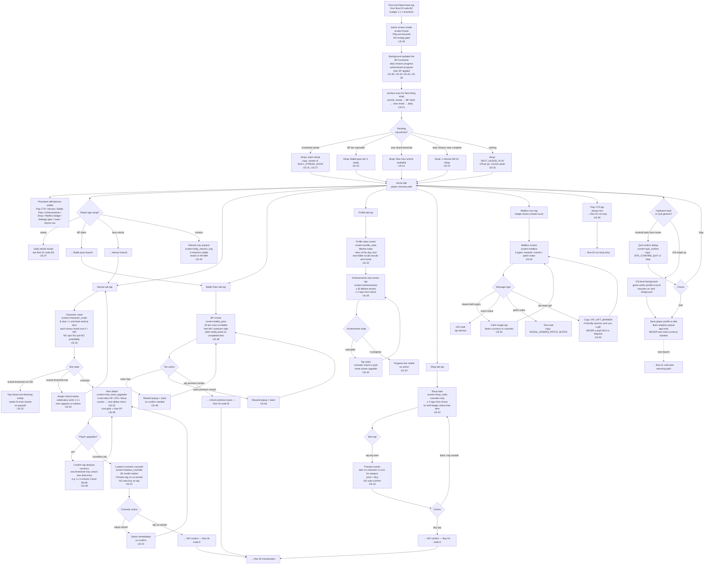

# UX Flow 03 — Run-End and Meta

> The flow from "run-end tally fully banked" through "player spends earned currency in the meta layer." Owner: ux-designer. Consumers: ui-engineer, systems-engineer. Source user stories: US-30 to US-42, plus US-50, US-58. Sister flows: `02-run-loop.md` (entry) and `04-monetization-and-iap.md` (purchase branches).

## KPI guardrails

- **Home strap tap-rate ≥ 35%** on the "Next thing" surface (US-31).
- **Character unlock action ≤ 2 taps** from Home → roster → Unlock (US-32).
- **Battle pass claim tap-rate ≥ 50%** when claimable tier exists (US-35).
- **Play CTA always live** — no energy / cooldown text anywhere (US-36).
- **Daily mission tray loads in ≤ 1 frame** after Home render (US-33).

## Screens referenced

| Screen key | Wireframe target | First appearance |
|---|---|---|
| `screen=home` | `05-wireframes/36-home-play-cta.html` + `31-home-next-thing.html` | flow entry |
| `screen=daily_mission_tray` | `05-wireframes/33-daily-missions.html` | Home idle |
| `screen=mailbox` | `05-wireframes/40-mailbox.html` + `50-gift-inbox.html` | Mailbox tap |
| `screen=character_roster` | `05-wireframes/32-char-roster.html` | Heroes tap |
| `screen=char_level_upgrades` | `05-wireframes/38-char-level-upgrades.html` | Roster → hero tap |
| `screen=loadout_cosmetic` | `05-wireframes/41-loadout-cosmetic.html` | Hero → cosmetics tab |
| `screen=battle_pass` | `05-wireframes/48-battle-pass.html` | BP tap |
| `screen=achievements` | `05-wireframes/34-achievements.html` | Profile → Achievements |
| `screen=profile_stats` | `05-wireframes/42-profile-stats.html` | Profile tap |
| `screen=shop_main` | `05-wireframes/43-shop-main.html` | Shop tap |
| `screen=quit_confirm` | wireframe placeholder | Hardware back / Quit |

## Flow

## Branching: graceful quit (US-08 + US-36 implications)

- Quit from anywhere in Home is a **single tap on a confirm dialog** (no nag, no upsell, no "are you sure you want to leave your unclaimed reward?").
- All earned currencies (banked from any past run) are already on disk — no quit-time data loss possible.
- Background-on-iOS uses OS auto-save; foreground resume returns to Home (`screen=home`) — never to mid-run state (runs are sandboxed per `01-core-loop.md`).

## Anti-pattern enforcement (meta)

- **No energy / stamina bar** anywhere (US-36). Settings screen does not even mention these concepts.
- **No locked biome → paywall modal** ever (US-39). Only a non-blocking requirement tooltip.
- **No gacha / pull / spin UI** on character roster (US-32). Direct shard cost only.
- **No combat-power items** in the shop (US-43). Cosmetic-only.
- **No dev-gift message disguising an IAP offer** (US-50).
- **No achievement claim grants a power upgrade** (US-34). Cosmetic shards or gold only.

## Tone-bible-validated copy in this flow

- `{NEXT_NUDGE_PLAY}: "Off we go. Carrots await."` (US-31)
- `{DAILY_STREAK_HOOK}: "Three days running. Sturdy little adventurer."` (US-37)
- `{MISSION_KILL_50}: "Send 50 rascals packing."` (US-33)
- `{MAIL_GIFT_FROM_DEV}: "A small basket from the team. Thanks for sticking around."` (US-40)
- `{IAP_GIFT_BANNER}: "A friendly sponsor sent you a gift."` (US-50)
- Achievement names use "rascals sent home" not "kills" (US-34, tone bible §2).

## Meta-loop loops back to run-loop

The Home → Play CTA is the only exit point that re-enters `02-run-loop.md`. Every other meta path returns to Home with a single Back tap. Designers verify this in wireframe pass.
