# UX Flow 04 — Monetization and IAP

> Every monetary touchpoint in the game: cosmetic IAP, battle pass purchase, subscription products, rewarded-ad surfaces, restore-purchases. **CRITICAL**: this flow must honor `docs/01-research/03-positioning.md` no-pay-to-win + no-energy-gate + no-gear-gacha. Tone bible: warm-not-salesy. Owner: ux-designer. Consumers: ui-engineer, systems-engineer. Source user stories: US-22, US-29, US-43..54, plus rewarded-ad surfaces from US-15, US-44, US-47.

## KPI guardrails

- **Decline button ≥ 120 pt and pre-focused** on every opt-in ad/IAP surface (US-22, US-47).
- **Accept button ≤ 88 pt (still HIG-compliant)** and never pre-focused on the same surfaces.
- **IAP confirm requires explicit checkbox** on any subscription (US-45).
- **Auto-decline timer 5–8 s** on every rewarded-ad surface (US-22, US-47).
- **`rewarded_ad_attach_rate` per surface** tracked separately (US-44).
- **No SKU above $19.99** anywhere (US-45).
- **No tier-skip pack above $4.99** (US-48).

## Screens referenced

| Screen key | Wireframe target | Triggered by |
|---|---|---|
| `screen=shop_main` | `05-wireframes/43-shop-main.html` | Home → Shop |
| `screen=cosmetic_preview` | within `43-shop-main.html` | Tap item |
| `screen=iap_confirm` | `05-wireframes/45-iap-confirm.html` | Buy tap |
| `screen=battle_pass` | `05-wireframes/48-battle-pass.html` | Home → BP |
| `screen=bp_premium_confirm` | extension of `45-iap-confirm.html` | Unlock premium tap |
| `screen=monthly_card` | `05-wireframes/51-monthly-card.html` | Shop → Monthly Card |
| `screen=growth_fund` | `05-wireframes/52-growth-fund.html` | Shop → Growth Fund |
| `screen=starter_pack` | `05-wireframes/49-starter-pack.html` | Auto-show run-end #3 |
| `screen=revive_offer` | `05-wireframes/22-revive-offer.html` | HP = 0 in-run |
| `screen=2x_gold_offer` | `05-wireframes/47-2x-gold-offer.html` | After run-end tally |
| `screen=rewarded_ad_cta` | `05-wireframes/44-rewarded-ad-cta.html` | Generic pattern |
| `screen=restore_purchases` | `05-wireframes/54-restore-purchases.html` | Settings → Restore |

## Flow

```mermaid
flowchart TD
    %% ===== A. COSMETIC SHOP IAP =====
    A[Home → Shop tab tap<br/>≤ 2 taps from Home<br/>NO notif badge unless free item<br/>US-43] --> B[Shop main<br/>screen=shop_main<br/>cosmetic-only<br/>NO power items<br/>US-43]
    B --> C[Browse cards<br/>skins / hats / emotes / weapons-visual]
    C --> D[Tap cosmetic card<br/>screen=cosmetic_preview<br/>3D model rotates<br/>price + Buy<br/>NO auto-confirm<br/>US-43]
    D --> E{Player action}
    E -->|Back / tap outside| B
    E -->|Buy tap| F[IAP confirm screen<br/>screen=iap_confirm<br/>shows: name / visual / local price / One-time purchase label<br/>price pulled from store-server<br/>US-45, US-53]
    F --> G{Confirm tap}
    G -->|cancel| D
    G -->|confirm| H[Native StoreKit / Play Billing sheet<br/>OS-level — out of our UI]
    H --> I{Store result}
    I -->|success| J[Receipt validated<br/>cosmetic added to wardrobe<br/>celebration anim 1.2 s<br/>copy: thank-you in tone-bible voice]
    I -->|cancel| D
    I -->|error| K[Error modal<br/>copy: friendly explanation<br/>retry / cancel options]
    J --> B
    K --> D

    %% ===== B. BATTLE PASS PREMIUM =====
    L[Home → Battle Pass tab tap] --> M[BP screen<br/>screen=battle_pass<br/>50 tiers / free + premium split<br/>Unlock premium pass CTA top<br/>single price visible<br/>US-48]
    M --> N{Player action}
    N -->|claim free tier| O[Reward banked<br/>US-48]
    N -->|claim owned premium tier| P[Reward banked]
    N -->|Unlock premium CTA tap| Q[BP premium confirm<br/>screen=bp_premium_confirm<br/>price ≤ $9.99<br/>One-time purchase label<br/>US-48]
    Q --> R{Confirm}
    R -->|cancel| M
    R -->|confirm| S[Native store sheet]
    S --> T{Result}
    T -->|success| U[Premium track unlocked<br/>previously-greyed tiers color-up<br/>any back-claimable tiers pulse]
    T -->|cancel / error| M
    U --> M

    %% ===== C. SUBSCRIPTION — MONTHLY CARD =====
    V[Shop → Monthly Card tile tap] --> W[Monthly Card screen<br/>screen=monthly_card<br/>SKU $4.99 / month auto-renew<br/>shows: 1× premium bundle + 30× daily gold drops<br/>Renews monthly. Cancel anytime in your store.<br/>US-51]
    W --> X{Subscribe tap}
    X -->|cancel| V
    X -->|tap| Y[IAP confirm with subscription label<br/>screen=iap_confirm subscription variant<br/>REQUIRED checkbox: I understand this renews<br/>US-45, US-51]
    Y --> Z{Checkbox + confirm}
    Z -->|checkbox unchecked| Y
    Z -->|both checked + confirm| AA[Native store subscription sheet]
    AA --> AB{Result}
    AB -->|success| AC[Daily drop appears on Home strap each day<br/>missed days bank up to 7-day cap<br/>US-51]
    AB -->|cancel / error| V

    %% ===== D. ONE-TIME GROWTH FUND =====
    AD[Shop → Growth Fund tile tap] --> AE[Growth Fund screen<br/>screen=growth_fund<br/>SKU $9.99 one-time<br/>10-milestone reward track<br/>cosmetic + currency only<br/>NEVER stat upgrade<br/>US-52]
    AE --> AF{Buy tap}
    AF -->|cancel| AD
    AF -->|buy| AG[IAP confirm one-time variant<br/>NO renewal checkbox needed<br/>US-45]
    AG --> AH[Native store sheet → success]
    AH --> AI[Milestone tracker visible<br/>rewards unlock as gameplay milestones hit<br/>no expiry<br/>US-52]

    %% ===== E. STARTER PACK (auto-show ONCE per profile) =====
    AJ[Run-end of run #3<br/>telemetry validated<br/>after tally banks<br/>US-49] --> AK[Starter pack modal<br/>screen=starter_pack<br/>cosmetic skin preview + soft-currency + price<br/>Maybe later button decline<br/>STARTER_DECLINE copy<br/>US-49]
    AK --> AL{Choice}
    AL -->|Maybe later / tap outside| AM[Mark shown=true<br/>NEVER re-surfaces as modal<br/>still browsable in Shop<br/>US-49]
    AL -->|Buy| AN[→ IAP confirm — node F flow]

    %% ===== F. REWARDED-AD SURFACES (6 surfaces) =====
    AO[Generic rewarded-ad opt-in pattern<br/>screen=rewarded_ad_cta<br/>US-44] --> AP[Surface shows<br/>reward type + quantity inline<br/>e.g. Watch ad: +50 gold<br/>play-icon glyph<br/>word Watch not Free<br/>US-44]
    AP --> AQ[Decline button LARGER ≥ 120 pt PRE-FOCUSED<br/>Accept button smaller ≥ 88 pt<br/>auto-decline timer 5-8 s<br/>US-22 pattern]
    AQ --> AR{Choice}
    AR -->|Decline / timeout| AS[Surface closes<br/>no re-prompt this trigger<br/>US-47]
    AR -->|Accept| AT[Ad SDK load<br/>spinner if > 1 s]
    AT --> AU{SDK result}
    AU -->|fill + watched| AV[Reward granted<br/>continue gameplay or meta context]
    AU -->|no fill| AW[Fallback toast<br/>copy: AD_NO_FILL<br/>No friendly sponsor right now. Try again in a bit.<br/>US-44]
    AU -->|user closed early| AX[No reward<br/>silent return to context<br/>no penalty]

    %% ----- 6 specific ad surfaces -----
    AY[1. Revive at death<br/>screen=revive_offer<br/>see flow 02 node BH<br/>1× per run<br/>US-22] --> AO
    AZ[2. 2x end-tally gold<br/>screen=2x_gold_offer<br/>see flow 02 node BV<br/>1× per run-end<br/>US-47] --> AO
    BA[3. Daily chest claim<br/>Home daily strap<br/>opt-in for bonus claim<br/>1× per day] --> AO
    BB[4. +1 banish slot in-run<br/>second banish requires ad<br/>see flow 02 node AL<br/>US-15] --> AO
    BC[5. Magnet boost in-run<br/>optional pre-wave boost<br/>1× per run<br/>tone-bible copy] --> AO
    BD[6. Free re-roll in draft<br/>second re-roll requires ad<br/>see flow 02 node AP<br/>US-29] --> AO

    %% ===== G. RESTORE PURCHASES =====
    BE[Settings → Account section<br/>see flow 05<br/>US-54] --> BF[Restore purchases button<br/>screen=restore_purchases<br/>US-54]
    BF --> BG[Tap triggers platform-native restore<br/>App Store or Play Store dialog<br/>US-54]
    BG --> BH{Result}
    BH -->|success| BI[Confirmation modal<br/>lists restored SKUs<br/>entitlements updated immediately<br/>US-54]
    BH -->|no purchases| BJ[Friendly explanation<br/>No purchases found on this account<br/>Contact us mailto link<br/>US-54]
    BH -->|error| BK[Generic error + retry option]
```



## No-paywall guardrails — flows that DO NOT exist

These flows are deliberately absent from the game and any attempt to add them fails QA / release gate:

- **No IAP popup mid-run.** Zero monetary surfaces between joystick-down and run-end tally.
- **No interstitial ads ever.** Not on cold-start, not between runs, not on death (US-46 lint rule in `Scripts/Gameplay/`).
- **No auto-renew opt-in without explicit checkbox tap** (US-45). Subscription requires `[ ] I understand this renews` to be checked before the native store sheet appears.
- **No IAP gating of progression.** Every locked biome shows a gameplay requirement (US-39), every locked character shows a shard cost (US-32), zero "Unlock with $1.99" buttons exist anywhere.
- **No region-priced exploit SKUs** (US-53). All prices come from store-server tier tables at runtime.
- **No gacha pull / spin animation** for characters or gear (US-32). Direct shard cost only.
- **No SKU above $19.99 USD equivalent** (US-45). No tier-skip pack above $4.99 (US-48). No premium-currency pack above $19.99.
- **No "buy higher rank" leaderboard option** (US-56 — referenced in flow 03).
- **No dev-gift message disguising a paid SKU** (US-50). Gift messages never link directly to a paid offer.
- **No paid stat upgrades.** Growth Fund / Monthly Card / Battle Pass rewards are cosmetic + soft-currency only.
- **No nag-banner on Home** for any SKU. Starter pack appears **once** at run-end #3 then never again as a modal (US-49).
- **No "Free!" surprise reveals.** Rewarded-ad CTAs always show reward type + quantity inline before tap (US-44).
- **No silent decline penalty.** Declining any ad/IAP surface returns to context with zero state change.

## Decline-larger-and-pre-focused pattern (universal)

Every opt-in surface in this flow uses the identical button-weighting pattern (origin US-22):

```
+-------------------------------+
|   [reward icon + description] |
|   [Watch ad: +N gold]         |   <-- accept: ≥ 88 pt, NOT pre-focused
|                               |
|   [   Take what I earned   ]  |   <-- decline: ≥ 120 pt, PRE-FOCUSED, larger
|                               |
|   auto-decline in 8 s         |
+-------------------------------+
```

The decline button is always:
1. Larger (≥ 120 pt vs ≥ 88 pt).
2. Pre-focused (initial-focus accessible target).
3. Below the accept button (closer to thumb).
4. The default destination if the auto-decline timer expires.

## Tone-bible-validated copy in this flow

- `{STARTER_DECLINE}: "Maybe later."` (US-49)
- `{HERO_REVIVE}: "Bunny got knocked silly. Want a quick nap and one more try?"` (US-22)
- `{AD_NO_FILL}: "No friendly sponsor right now. Try again in a bit."` (US-44)
- `{IAP_GIFT_BANNER}: "A friendly sponsor sent you a gift."` (US-50)
- Subscription label: "Renews monthly. Cancel anytime in your store." (US-51)
- Restore success: "We brought back: [list]." (US-54)
- Restore no-purchases: "No purchases found on this account." (US-54)

## Anti-pattern QA checks (consolidated)

| Check | Pass criteria | Origin |
|---|---|---|
| Lint `AdMob.ShowInterstitial()` | Zero hits in `Scripts/Gameplay/` | US-46 |
| Shop SKU stats audit | No SKU modifies `weapons.json` / character stats | US-43 |
| Decline button size | ≥ 120 pt on every opt-in modal | US-22, US-47 |
| Pre-focus accessibility | Decline is initial focus on every opt-in modal | US-22, US-47 |
| Subscription confirm | Checkbox required before native sheet | US-45, US-51 |
| Starter pack frequency | Telemetry confirms 1 modal per profile lifetime | US-49 |
| Price source | All prices from store-server at runtime | US-53 |
| Tier-skip cap | No SKU above $4.99 if labelled tier-skip | US-48 |
| Bundle cap | No SKU above $19.99 USD equivalent | US-45 |
