# UX Flow 05 — Settings and Accessibility

> The settings entry from Home, the sub-screen tree (Audio / Language / Haptics / Accessibility / Privacy / Account), the credits screen, and the privacy policy webview. Owner: ux-designer. Consumers: ui-engineer, systems-engineer. Source user stories: US-02 (re-tour), US-08 (account-link), US-10 (language), US-11 (mute + haptics), US-54 (restore), US-61 (block/report — though that lives in social flow). WCAG references from art bible.

## KPI guardrails

- **Settings entry ≤ 1 tap** from Home (gear icon top-right).
- **Sub-screen navigation ≤ 2 taps** to reach any setting.
- **All toggles save-on-change** — no separate Save button (Pillar 5).
- **Mute toggle persists immediately** with 1-frame icon response (US-11).
- **Language change applies immediately** without app restart (US-10).
- **WCAG AA contrast** — body text ≥ 4.5:1, large text ≥ 3:1 (art bible).

## Screens referenced

| Screen key | Wireframe target | Reached from |
|---|---|---|
| `screen=home` | `05-wireframes/36-home-play-cta.html` | flow entry |
| `screen=settings_main` | wireframe placeholder | Gear icon tap |
| `screen=settings_audio` | wireframe placeholder | Audio row |
| `screen=settings_language` | extension of `10-language-confirm.html` | Language row |
| `screen=settings_haptics` | wireframe placeholder | Haptics row |
| `screen=settings_accessibility` | wireframe placeholder | Accessibility row |
| `screen=settings_privacy` | wireframe placeholder | Privacy row |
| `screen=settings_account` | `05-wireframes/08-settings-account.html` | Account row |
| `screen=restore_purchases` | `05-wireframes/54-restore-purchases.html` | Account → Restore |
| `screen=credits` | wireframe placeholder | Credits row |
| `screen=privacy_webview` | OS in-app webview | Privacy policy link |
| `screen=reset_confirm` | wireframe placeholder | Reset preferences tap |

## Flow

```mermaid
flowchart TD
    %% ===== ENTRY =====
    A[Home<br/>screen=home<br/>gear icon top-right safe area] --> B[Settings main<br/>screen=settings_main<br/>list of sub-screens<br/>back arrow top-left]

    B --> C[Audio row]
    B --> D[Language row]
    B --> E[Haptics row]
    B --> F[Accessibility row]
    B --> G[Privacy row]
    B --> H[Account row]
    B --> I[Replay FTUE row<br/>copy: SETTINGS_REPLAY_FTUE<br/>Show me the basics again.<br/>US-02]
    B --> J[Credits row]
    B --> K[Reset preferences row]

    %% ===== AUDIO SUB-SCREEN =====
    C --> C1[Audio screen<br/>screen=settings_audio<br/>3 sliders: BGM / SFX / UI<br/>master mute toggle<br/>save-on-change<br/>NO Save button<br/>US-11]
    C1 --> C2[Slider drag<br/>volume applies live<br/>preview tick fires<br/>back arrow returns to settings_main]

    %% ===== LANGUAGE SUB-SCREEN =====
    D --> D1[Language screen<br/>screen=settings_language<br/>TR + EN at launch<br/>radio buttons<br/>US-10]
    D1 --> D2{Selection}
    D2 -->|TR| D3[Apply Turkish immediately<br/>no app restart<br/>persist to local profile<br/>US-10]
    D2 -->|EN| D4[Apply English immediately<br/>persist to local profile<br/>US-10]
    D3 --> B
    D4 --> B

    %% ===== HAPTICS SUB-SCREEN =====
    E --> E1[Haptics screen<br/>screen=settings_haptics<br/>single toggle<br/>iPhone default ON / Android default OFF<br/>save-on-change<br/>US-11]
    E1 --> E2[Toggle tap<br/>haptic preview fires once at new state<br/>back to settings_main]

    %% ===== ACCESSIBILITY SUB-SCREEN =====
    F --> F1[Accessibility screen<br/>screen=settings_accessibility]
    F1 --> F2[Reduced motion toggle<br/>WCAG 2.3.3<br/>disables time-dilates over 200 ms<br/>preserves gameplay impact]
    F1 --> F3[Larger text toggle<br/>+15% body size<br/>maintains ≥ 4.5:1 contrast]
    F1 --> F4[Colorblind-friendly mode<br/>placeholder for post-launch<br/>3 palette presets: deuteranopia / protanopia / tritanopia]
    F1 --> F5[Screenshake toggle<br/>OFF disables all Pillar 1 shake<br/>kill VFX still fires]
    F1 --> F6[Audio cue boost<br/>raises kill / pickup SFX +3 dB for low-vision]
    F2 --> F7[Save-on-change<br/>applies to next frame<br/>WCAG AA reference visible in copy]
    F3 --> F7
    F4 --> F7
    F5 --> F7
    F6 --> F7

    %% ===== PRIVACY SUB-SCREEN =====
    G --> G1[Privacy screen<br/>screen=settings_privacy<br/>required for compliance]
    G1 --> G2[Analytics opt-out toggle<br/>default ON<br/>copy explains: helps us tune the game<br/>save-on-change]
    G1 --> G3[Ad personalization opt-out toggle<br/>required GDPR / KVKK<br/>default region-dependent<br/>TR uses KVKK / EU uses GDPR / others IDFA]
    G1 --> G4[Privacy policy link<br/>opens screen=privacy_webview<br/>OS in-app webview<br/>back returns to settings_privacy]
    G2 --> G5[Save-on-change applies to next telemetry event]
    G3 --> G5

    %% ===== ACCOUNT SUB-SCREEN =====
    H --> H1[Account screen<br/>screen=settings_account<br/>copy: ACCOUNT_LINK_OFFER<br/>opt-in only<br/>NEVER nag<br/>US-08]
    H1 --> H2[Sign in with Apple<br/>optional<br/>iOS only]
    H1 --> H3[Sign in with Google<br/>optional<br/>Android primary]
    H1 --> H4[Restore purchases button<br/>→ flow 04 node BF<br/>US-54]
    H1 --> H5[Local profile ID visible<br/>for support contact]
    H2 --> H6[OAuth sheet<br/>OS-native<br/>on success: cloud-save linked]
    H3 --> H6

    %% ===== REPLAY FTUE =====
    I --> I1[Confirm dialog<br/>Replay the basics?<br/>Yes / No]
    I1 --> I2{Choice}
    I2 -->|Yes| I3[Reset firstRunCompleted flag in session memory<br/>NOT in persistent profile<br/>→ flow 01 first-time path]
    I2 -->|No| B

    %% ===== CREDITS =====
    J --> J1[Credits screen<br/>screen=credits<br/>team list + thank-yous<br/>CC-BY attributions from assets-raw/LICENSES.md<br/>scrollable]
    J1 --> J2[Each attribution links to original author / license URL<br/>via in-app webview]

    %% ===== RESET PREFERENCES =====
    K --> K1[Reset preferences dialog<br/>screen=reset_confirm<br/>Are you sure? Yes / No<br/>warns: this clears audio / haptics / accessibility / language NOT progress]
    K1 --> K2{Choice}
    K2 -->|Yes| K3[Reset settings to defaults<br/>preserve player progress<br/>preserve account link<br/>back to settings_main]
    K2 -->|No| B

    %% ===== EXIT =====
    C2 --> B
    E2 --> B
    F7 --> B
    G5 --> B
    H6 --> B
    K3 --> B
    B --> Z[Back arrow tap<br/>returns to screen=home]
```

## WCAG and accessibility references (art-bible-derived)

| Surface | Requirement | Source |
|---|---|---|
| Body text | ≥ 4.5:1 contrast against background | WCAG AA + art bible |
| Large text (≥ 18 pt) | ≥ 3:1 contrast | WCAG AA + art bible |
| Tap targets | ≥ 88 pt minimum (Pillar 5) | iOS HIG + Feel Pillar 5 |
| Time-based dismissals | All auto-dismiss can be disabled via Reduced Motion toggle | WCAG 2.2.1 |
| Animations > 200 ms | Suppressed when Reduced Motion is on | WCAG 2.3.3 |
| Colorblind | 3-preset palette (post-launch placeholder) | WCAG 1.4.1 |
| Audio-only cues | Paired with visual cue (kill flash + sound) | WCAG 1.1.1 |
| Language change | Applies live, no restart | WCAG 3.1.2 spirit |

## Anti-pattern enforcement (settings)

- **No "Save" button on any sub-screen** — every toggle saves on change (Pillar 5).
- **No "Restart to apply" required** for language, audio, accessibility, or haptics.
- **No account-create wall** — Account is opt-in only, no nag modal on Home (US-08).
- **No setting hidden behind paywall** — every accessibility option is free.
- **No mention of "energy" / "stamina" anywhere in Settings** (US-36 — explicit acceptance criterion).
- **Reset preferences never resets gameplay progress** (currency, characters, BP).

## Tone-bible-validated copy in this flow

- `{SETTINGS_REPLAY_FTUE}: "Show me the basics again."` (US-02)
- `{ACCOUNT_LINK_OFFER}: "Sign in to keep your carrots safe across devices."` (US-08 inferred)
- Reset confirm: "Reset your preferences? Your progress and carrots stay safe."
- Credits header: "A small basket of thanks." (tone bible warmth)

## Handoffs

- Re-tour (node I3) hands off to `01-cold-start.md` first-time path.
- Restore purchases (node H4) hands off to `04-monetization-and-iap.md` node BF.
- Back from Home settings entry returns to `03-run-end-and-meta.md` Home node K.
- Privacy webview is OS-native, out of scope for wireframes (link only).
