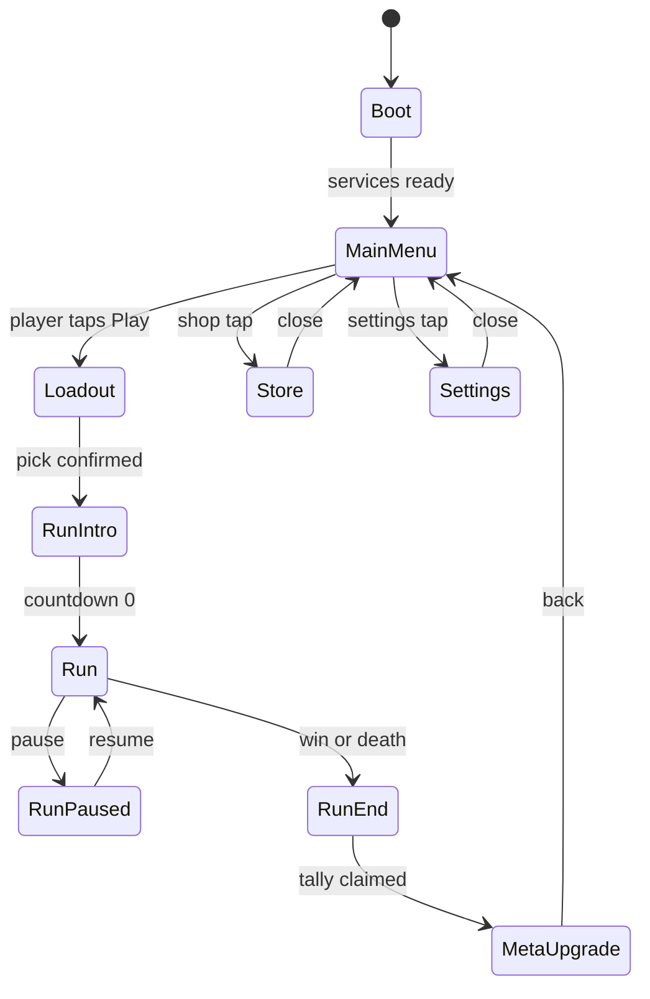

# Tech Spec 08 — State Machine

> Owner: tech-architect. The high-level game state graph for Brave Bunny: states, transitions, entry/exit actions, save triggers, scene loading policies, and the `IGameState` implementation pattern. Cross-refs: `02-gdd/01-core-loop.md` (minute-to-minute + session-to-session loops — the design source), `01-project-layout.md` (4 scenes: Boot / MainMenu / Run / Test), `03-save-system.md` (save trigger list), `04-input-system.md` (Player vs UI action map switching). Sister doc: `09-event-bus.md` for the in-state messaging pattern.

## State graph



States that show modally over MainMenu (Store, Settings) **do not unload MainMenu** — they overlay UI Toolkit panels.

## States — entry, exit, allowed transitions, save behavior

### `Boot`

- **Entry actions:** initialize logger; instantiate `GameContext` service locator; register `IAudioService`, `ISaveService`, `ICatalogService`, `IInputService`; kick off `SaveLoader.Load()` (per `03-save-system.md`); initialize Unity Localization; warm up `AudioMixer` snapshots; cache device class (`SystemInfo.deviceModel`) for SE 3 / low-power degrade decisions per `05-performance-budget.md`.
- **Exit actions:** none (services persist).
- **Allowed transitions:** `Boot → MainMenu` only.
- **Save trigger?** No (save was just *loaded*).
- **Loaded scenes:** `Boot.unity` (alone, no additive).
- **Asset bundle policies:** Pre-warm character/weapon/enemy catalogs from `Assets/_Brave/Data/Balance/` (Resources.LoadAll, ~10 ms one-time cost — outside hot path).
- **Notes:** No UI shown beyond a 1-frame splash; if `SaveLoader.Load()` returns the corruption-recovery path per `03-save-system.md`, surface a non-blocking toast on first `MainMenu` paint.

### `MainMenu`

- **Entry actions:** transition AudioMixer to `Snapshot_Home`; switch input map to `UI`; show home HUD (Play button, currencies, daily-streak indicator, shop+settings buttons); fire `DailyStreakChannel.Raise()` once per UTC date for the streak-claim modal.
- **Exit actions:** clear ephemeral home-screen toasts; remember last-selected loadout for `Loadout` state.
- **Allowed transitions:** `→ Loadout` (Play tap), `→ Store` (shop tap), `→ Settings` (settings tap). All return paths come back here.
- **Save trigger?** No state-entry save; **daily-streak claim** triggers a save (per `03-save-system.md` trigger list — "Achievement claimed" pattern).
- **Loaded scenes:** `MainMenu.unity` (alone).
- **Asset bundle policies:** Lazy-load store / battle-pass UI panels on demand from `Assets/_Brave/UI/Screens/`.

### `Loadout`

- **Entry actions:** show loadout screen — biome picker + character picker + weapon picker (per ADR-0001 universal pool); audio snapshot stays on `Snapshot_Home`; input map remains `UI`.
- **Exit actions:** persist last-equipped weapon to `equippedWeaponSlug` field per save schema; pass selected `RunConfig` to `RunIntro` state.
- **Allowed transitions:** `→ RunIntro` (Confirm tap), `→ MainMenu` (Back).
- **Save trigger?** **Yes** — on equipping a different weapon (per `03-save-system.md` "Cosmetic equipped" pattern; weapon equip uses the same trigger).
- **Loaded scenes:** still `MainMenu.unity`; Loadout is a UI overlay.
- **Asset bundle policies:** Lazy-load biome thumbnails from `BiomeDefinition.thumbnail`.

### `RunIntro`

- **Entry actions:** **load `Run.unity`** (synchronous `SceneManager.LoadScene` — load cost gated by Unity loading screen ~0.5 s acceptable per `05-performance-budget.md` cushion); transition AudioMixer to `Snapshot_Lobby` → `Snapshot_Run_<biome>` over 800 ms (per `04-mixer-routing.md`); instantiate hero prefab from `CharacterDefinition.prefab`; spawn-in countdown 3 → 2 → 1 → GO; **input map switches to `Player` only on countdown = 0**.
- **Exit actions:** dismiss countdown UI.
- **Allowed transitions:** `→ Run` (countdown reaches 0), `→ MainMenu` (back-out during countdown — Phase 6 polish only; not in vertical slice).
- **Save trigger?** No.
- **Loaded scenes:** `Run.unity` loaded; `MainMenu.unity` unloaded.
- **Asset bundle policies:** Pre-warm pools for the chosen biome's swarmer/tank/ranged enemy prefabs + projectile prefabs from selected weapons (per ADR-0005 pool API). One-time alloc; zero allocations during `Run`.

### `Run`

- **Entry actions:** wave driver starts (`WaveDefinition.events` schedule); input map = `Player`; `Application.targetFrameRate = 60` (or 50 for SE 3); haptic-feedback service warmed.
- **Exit actions:** wave driver stops; per-frame jobs (collision broadphase, spawning) cancelled cleanly via `JobHandle.Complete()`.
- **Allowed transitions:** `→ RunPaused` (pause tap), `→ RunEnd` (hero HP = 0 with no revive, OR boss death + win condition).
- **Save trigger?** **No saves during a run.** Per `05-performance-budget.md` and `03-save-system.md` explicit non-trigger: saves are event-driven, never every frame.
- **Loaded scenes:** `Run.unity` (alone — additive not used per `01-project-layout.md`).
- **Asset bundle policies:** **No runtime asset loads.** All run prefabs pre-warmed in pools at `RunIntro` entry. Texture LOD streaming disabled.

### `RunPaused`

- **Entry actions:** set `_MasterPause = true` on AudioMixer (per `04-mixer-routing.md`); `Time.timeScale = 0`; show pause modal UI (resume / quit-to-menu buttons); input map switches to `UI`.
- **Exit actions:** restore `Time.timeScale = 1`; `_MasterPause = false`; input map back to `Player`; dismiss pause modal.
- **Allowed transitions:** `→ Run` (resume), `→ RunEnd` (quit-to-menu — counts as a death with no run rewards, per `01-core-loop.md` failure-loop semantics).
- **Save trigger?** No.
- **Loaded scenes:** `Run.unity` (still loaded; pause is overlay UI).
- **Asset bundle policies:** None.

### `RunEnd`

- **Entry actions:** transition AudioMixer to `Snapshot_Run_End_Win` or `Snapshot_Run_End_Lose` (per `04-mixer-routing.md`, 400 ms); show tally screen (gold / soul-shards / pass-XP banks with 250 ms slam-per-line); offer rewarded-ad revive if death + first death of run; input map switches to `UI`.
- **Exit actions:** dismiss tally screen; clear in-run state.
- **Allowed transitions:** `→ MetaUpgrade` (Claim tap on tally), `→ Run` (Continue tap after revive ad watched — re-enters Run state with i-frames, per `01-core-loop.md`).
- **Save trigger?** **Yes** — on tally finish (per `03-save-system.md` "Run-end (death or win)" trigger). Currencies, character XP, achievements, daily-mission progress, and stats all flush in one save write.
- **Loaded scenes:** `Run.unity` (still loaded; tally is overlay).
- **Asset bundle policies:** None.

### `MetaUpgrade`

- **Entry actions:** **unload `Run.unity`, load `MainMenu.unity`**; show meta-upgrade tree screen overlay; audio snapshot transitions to `Snapshot_Home` (800 ms per `04-mixer-routing.md` "Run-end → Home").
- **Exit actions:** dismiss upgrade screen.
- **Allowed transitions:** `→ MainMenu` (Back / Done tap).
- **Save trigger?** **Yes** — on each upgrade node purchase (per `03-save-system.md` "Battle pass tier-up" pattern; upgrade nodes are character-meta tier-ups).
- **Loaded scenes:** `MainMenu.unity`.
- **Asset bundle policies:** None.

### `Store`

- **Entry actions:** show store UI (cosmetics, battle pass, IAP packages); audio snapshot stays `Snapshot_Home`; input map stays `UI`.
- **Exit actions:** dismiss store UI.
- **Allowed transitions:** `→ MainMenu` (close).
- **Save trigger?** **Yes on IAP purchase confirmation** (per `03-save-system.md` "IAP purchase confirmed" trigger).
- **Loaded scenes:** `MainMenu.unity` (Store is overlay UI).
- **Asset bundle policies:** Lazy-load store icons.

### `Settings`

- **Entry actions:** show settings modal; populate sliders + toggles from current save state; input map stays `UI`.
- **Exit actions:** persist any changes back to `SaveState.settings`.
- **Allowed transitions:** `→ MainMenu` (close).
- **Save trigger?** **Yes** on close (per `03-save-system.md` "Settings changed" trigger). Single save write on modal close, not per-slider-tick.
- **Loaded scenes:** `MainMenu.unity`.
- **Asset bundle policies:** None.

## Memory + asset bundle policies (cross-state)

| Policy | Rule |
|---|---|
| **Additive scene loading** | Not used at launch (per `01-project-layout.md`). Each scene swap fully unloads the previous scene. |
| **Pool pre-warm scope** | At `RunIntro` entry only. Pool sizes from ADR-0005 + `data/balance/pool-sizes.json`. |
| **Pool teardown** | At `RunEnd` exit (when transitioning to `MetaUpgrade`), all run-scoped pools are returned to the manager and their GameObjects destroyed. |
| **Texture streaming** | URP texture streaming **disabled** — runtime streaming spikes hit the perf budget; we pre-bake biome atlas sizes. |
| **Catalog cache** | `ICatalogService` populated once at `Boot`; held for app lifetime. Never reloaded. |
| **Audio clip cache** | SFX clips loaded at scene load per `07-audio.md`; BGM streamed (not cached). |

## Implementation pattern

No FSM library. A small `IGameState` interface + a single `GameStateManager` switch-statement-style dispatcher kept inside the `Brave.Boot` assembly. This keeps the state graph reviewable in one place and avoids the "where is the transition defined?" problem that FSM libraries create.

```csharp
public interface IGameState {
    GameStateId Id { get; }
    UniTask OnEnterAsync(GameContext ctx, StateTransitionPayload payload);
    UniTask OnExitAsync(GameContext ctx);
}

public enum GameStateId {
    Boot, MainMenu, Loadout, RunIntro, Run, RunPaused, RunEnd, MetaUpgrade, Store, Settings
}

public sealed class GameStateManager {
    private readonly GameContext _ctx;
    private IGameState _current;

    public GameStateManager(GameContext ctx) { _ctx = ctx; }

    public async UniTask TransitionTo(GameStateId next, StateTransitionPayload payload = default) {
        if (!IsTransitionAllowed(_current?.Id ?? GameStateId.Boot, next))
            throw new InvalidOperationException($"Illegal transition {_current?.Id} -> {next}");
        if (_current != null) await _current.OnExitAsync(_ctx);
        _current = _ctx.GetState(next);
        await _current.OnEnterAsync(_ctx, payload);
    }

    private static bool IsTransitionAllowed(GameStateId from, GameStateId to) {
        // hard-coded transition table; matches the state graph above
        // unit-tested in Brave.Tests.EditMode/GameStateGraphTests.cs
        ...
    }
}

public readonly struct StateTransitionPayload {
    public readonly RunConfig RunConfig;       // populated on Loadout -> RunIntro
    public readonly RunResult RunResult;       // populated on Run -> RunEnd
}
```

The `IsTransitionAllowed` table is a hard-coded `switch` — adding a new transition is a code change reviewed in PR, and a `[Test]` in `Brave.Tests.EditMode` walks the table and asserts it matches the Mermaid graph above (failure means doc drift).

`GameContext` is the service locator from `09-event-bus.md`; it owns the state instances (constructed once at `Boot`) and resolves them via `GetState(id)`.

## Cross-references

- `02-gdd/01-core-loop.md` — session + run loops (design source).
- `01-project-layout.md` — 4 scenes; no additive loading.
- `03-save-system.md` — save trigger list (cross-checked above).
- `04-input-system.md` — Player vs UI action map switching at state boundaries.
- `05-performance-budget.md` — no runtime asset loads during `Run`; SE 3 frame-rate cap policy.
- `06-rendering.md` — biome volume crossfade triggered at `RunIntro` entry.
- `07-audio.md` — mixer snapshot transitions per state boundary.
- `09-event-bus.md` — `GameContext` service locator that owns the state manager.
- ADR-0001 — universal weapon pool drives the `Loadout` data model.
