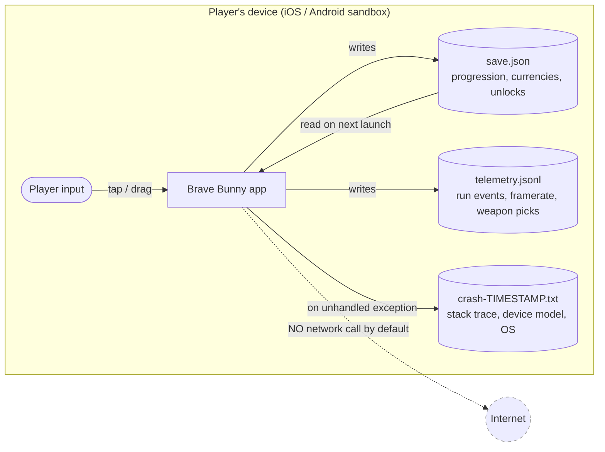
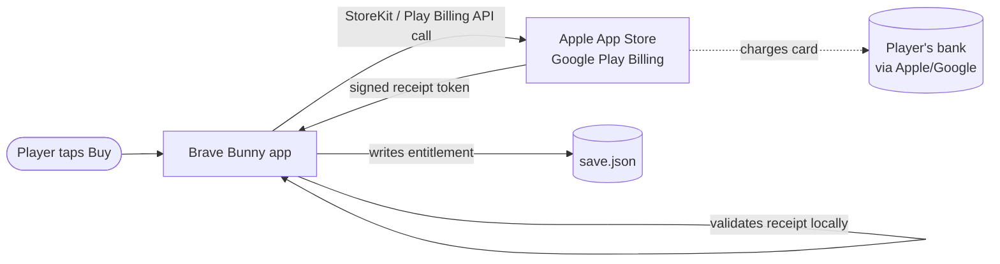
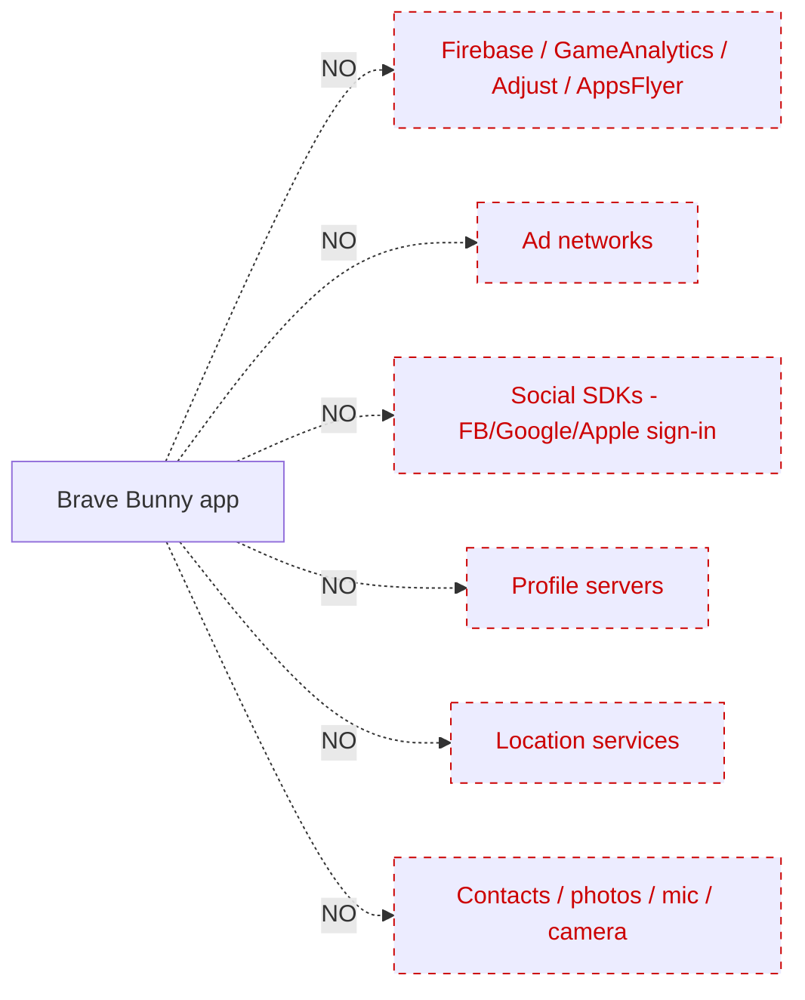

# Brave Bunny — Data Flow Diagram

> Companion to `privacy-policy.md`. Shows every byte of player-generated data, where it lives, where it can go, and what triggers movement.
> **Audience:** App Store / Google Play review teams, soft-launch security review, future contributors.

---

## 1. Default state (no data leaves the device)



**Key invariants in default state:**

- No network socket is opened by Brave Bunny code on launch, during play, or on background.
- All three files live inside the OS-protected app sandbox.
- No background workers, no fetch-on-launch, no "phone home" ping.

---

## 2. In-app purchase flow (only network path that is automatic)



**Notes:**

- The IAP path is the **only** automatic network call the app makes.
- We never see card data. Apple / Google handle the charge.
- The receipt token is anonymous to us — it does not contain player name, email, or address.
- After validation, only an entitlement (e.g. `owns_cosmetic_bunny_hat_01`) is written into the save file.

---

## 3. Opt-in telemetry share (manual, player-initiated)

```mermaid
flowchart LR
    Player([Player: Settings → Send anonymous telemetry]) --> Game[Brave Bunny app]
    Game -->|composes email with attachment| MailApp[OS mail-compose sheet<br/>Apple Mail / Gmail / etc.]
    Telemetry[(telemetry.jsonl)] -->|attached| MailApp
    Player -->|reviews and presses Send| MailApp
    MailApp -->|SMTP/TLS| Mailbox[telemetry@bravebunny.example<br/>inbox]
    Mailbox -.->|180-day retention<br/>per privacy policy| Delete[(Auto-purge)]

    classDef external fill:#eef
    class MailApp,Mailbox external
```

**Notes:**

- The mail-compose sheet is the OS share sheet — **we cannot send without the player tapping Send**.
- Player can edit, redact, or cancel.
- Email body contains only the JSONL file. No headers from the device beyond what the player's mail client adds.

---

## 4. Opt-in crash report share (manual, player-initiated)

```mermaid
flowchart LR
    Game[Brave Bunny app] -->|on next launch after a crash| Banner[Banner: A crash was logged.<br/>Send to developer?]
    Banner -->|Player declines| Discard[Local file kept,<br/>nothing sent]
    Banner -->|Player accepts| MailApp[OS mail-compose sheet]
    Crash[(crash-TIMESTAMP.txt)] -->|attached| MailApp
    Player([Player reviews and presses Send]) --> MailApp
    MailApp -->|SMTP/TLS| Mailbox[crashes@bravebunny.example<br/>inbox]
    Mailbox -.->|180-day retention| Delete[(Auto-purge)]

    classDef external fill:#eef
    class MailApp,Mailbox external
```

**Notes:**

- The banner has an **explicit "No thanks"** that is the larger of the two buttons (per `04-monetization-and-iap` opt-in pattern).
- Crash logs contain stack trace, device model (e.g. "iPhone 14"), OS version (e.g. "iOS 18.2"). No advertising ID, no IMEI, no MAC, no email, no location.

---

## 5. End-to-end data inventory

| Data | Lives | Goes to | Trigger | Network? |
|---|---|---|---|---|
| Save | App sandbox | Same file, never copied | Every run-end / settings change | No |
| Local telemetry | App sandbox | Same file, append-only | Every gameplay event | No |
| Crash log | App sandbox | Same file | On unhandled exception | No |
| IAP receipt | Apple/Google | Validated locally, hash written to save | Player taps Buy | **Yes** (Apple/Google only) |
| Telemetry email | Player's mail client | `telemetry@bravebunny.example` | Player taps Send | **Yes** (via player's mail provider) |
| Crash email | Player's mail client | `crashes@bravebunny.example` | Player taps Send | **Yes** (via player's mail provider) |

---

## 6. Things that do NOT happen



This is enforced by **`docs/06-tech-spec/11-third-party.md`** (allowed-SDK list) and the framework's `Zero external paid API` rule in the root `CLAUDE.md`.

---

## 7. Review questions and answers

**Q: Does the game collect any personal data?**
A: No, by default. With explicit opt-in, the player may email us anonymous telemetry or a crash log via their own mail client.

**Q: Does the game contact any server on launch?**
A: No. The only network calls are App Store / Play Billing during IAP, which the player initiates.

**Q: Is there any third-party SDK doing analytics, ads, or attribution?**
A: No. The full third-party SDK list is in `docs/06-tech-spec/11-third-party.md`.

**Q: How can a player delete all their data?**
A: Delete the app. There is no server-side record to remove.

---

*Diagram source: this file is the source of truth. Re-render in any Mermaid-capable renderer.*
